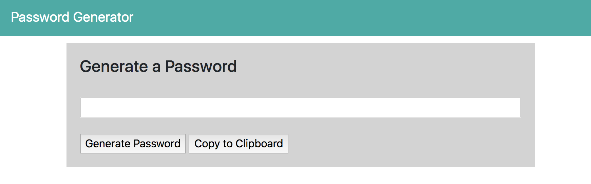

# Password-Generator
The purpose of the password generator is to help us users to create stronger passwords, so we can provide greater security for a given type of access. Weaker passwords make it not so hard for a person without knowledge to get into something without any trouble knowing. I want to generate the password with the number of at least 30 characters of numbers, specials, uppercase, and lowercase letters. 
https://jmrosenberg12.github.io/Password-Generator/
 
